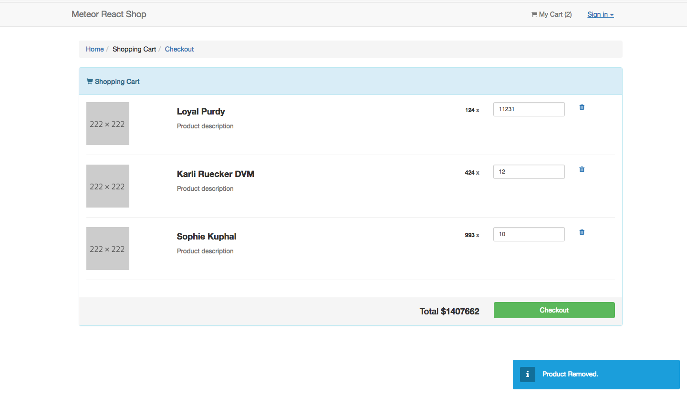

# Meteor React Shop

This is a simple e-commerce website built with Meteor and React.



## How to Start

```
git clone https://github.com/LIYINGZHEN/meteor-react-shop.git

cd meteor-react-shop

npm install --save

meteor --settings ./settings/development.json
```

You can login with Admin account :

```
Account  : admin
Password : admin
```

## Todo

If you know how to solve these problems please make a pull requests !

### 1. Stripe Integrations

### 2. User Management in Admin.js

It can't read my admin role in `componentWillMount` function.

Return undefined and will be redirect to home page.

### 3. User Management in Header.js

Same question above.

The first time login with admin account, `Roles.userIsInRole(Meteor.userId(), 'admin')` will return false.

But when you change page it will return true.
